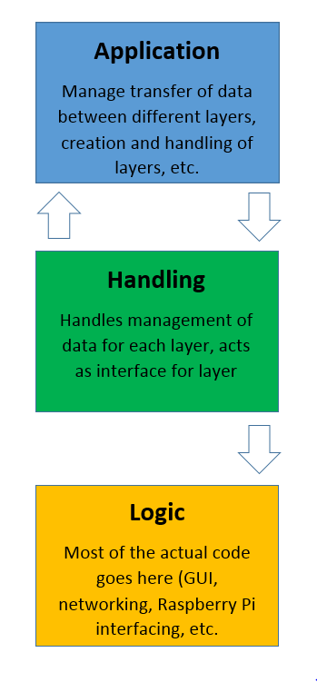

# Telemetry

**User Guide**

*Requirements*

   - This repository is divided into two actual sections, client code and service code,
    along with independent common code that is needed for both. To run either the
    client or service application, both the common code and application specific code
    is needed. However, you do not need the service code to run a client application or
    vice-versa.
    
    
   - ***Required libraries/modules:***
   
        - *Required for both:*
        
            - Twisted
   
        - *Service specific:*
               
            - Raspberry Pi GPIO libraries (eventually)
            
        - *Client specific:*
            
            - PySide2
            
**Architecture**

Each component of the application (networking, user interface, etc.) should be encapsulated so
that it can be changed without affecting the rest of the application. This is done by following
the above pattern. At the top level is the application layer, which contains the various handlers
for each layer. The handling layer handlers maintain the state and data for each component in the
logic layer. The logic layer is where most of the actual code is, and is where the data in the
handling layer is manipulated. The arrows represent how data should move between each layer. Since
the application layer's purpose is to allow communication between the different handlers,
data can move both to and from it to the handling layer. The logic layer also has access to the handling
layer, although by design the handling layer should never need to access the logic layer other
than to access function or class defintions, since it should not store any data.